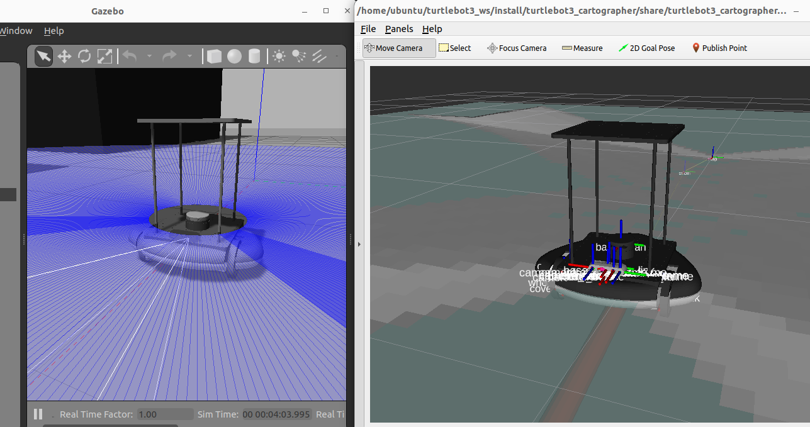

# my_turtlebot3

This is the ROS 2 package to control My TurtleBot3.



## Supported ROS 2 distributions

[![humble][humble-badge]][humble]
[![ubuntu22][ubuntu22-badge]][ubuntu22]

## Requirement

### Setting up the Turtlebot3 environment

Please refer to the following page for installation.

[ROS2: Turtlebot3のGazeboシミュレーションをHumble/Noeticで動かす](https://zenn.dev/tasada038/articles/0a69eb6c6b444f)

### Setting up the Hardware

Please create the TurtleBot3 Components below.

- Customized 3D printed wheels and ball casters.

[TurtleBot3 Friends: Carrier](https://emanual.robotis.com/docs/en/platform/turtlebot3/locomotion/#turtlebot3-friends-carrier)

## Build
```shell: Terminal
cd ~/dev_ws
colcon build --packages-select mb3_description mb3_gazebo
```

## Usage

- Gazebo Simulation

```shell: terminal
cd ~/dev_ws/
. install/setup.bash
ros2 launch mb3_gazebo display_gazebo.launch.py
```

```shell: terminal
cd ~/turtlebot3_ws/
. install/setup.bash
ros2 run turtlebot3_teleop teleop_keyboard
```

```shell: terminal
cd ~/turtlebot3_ws/
. install/setup.bash
ros2 launch turtlebot3_cartographer cartographer.launch.py use_sim_time:=True
```

## License
This repository is licensed under the Apache License license, see LICENSE.

[humble-badge]: https://img.shields.io/badge/-HUMBLE-orange?style=flat-square&logo=ros
[humble]: https://docs.ros.org/en/humble/index.html

[ubuntu22-badge]: https://img.shields.io/badge/-UBUNTU%2022%2E04-blue?style=flat-square&logo=ubuntu&logoColor=white
[ubuntu22]: https://releases.ubuntu.com/jammy/
